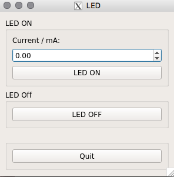

# Control the Hamamatsu MiniSpectrometer
 Author: Janine Müller

## Description
This Software controls a current source operated via RS232 which allows to pilot UV-LEDs to excite the fibre(s).  

The repository contains the source code as well as CMakeLists and a GUI version to operate such system.

## Requirements to run terminal program

Availability of the following libraries (author: Janine Müller):
* [RSS232Communication][4]

RS232 Currentsource:
* Make sure that your user is in group `dialout`

## Additional requirements to run GUI

Install QT5:
* QT5 uses different number format 
* add to your `.bashrc`:

```bash
export CMAKE_PREFIX_PATH=/usr/local/Qt-5.8.0/
export LC_NUMERIC=en_US.UTF-8
```

## How to run the control

### Terminal progamm

1.) Compile source code:

```bash
mkdir build
cd build
cmake ..
make
```

2.) Execute it:

```bash
./bin/LEDMain
```

3.) Follow instructions written in terminal.


### GUI

0.) Go to GUI folder

```bash
cd LED_gui
```

1.) Compile source code:

```bash
mkdir build
cd build
cmake ..
make
```

2.) Execute it:

```bash
./bin/LED_gui
```

3.) A window is opening to control the Spectrometer measurement. 
* Choose a current for the LED
* Hit the `LED ON` button to switch on the LED
* Hit the `LED OFF` button to switch off the LED



[4]: https://git.e5.physik.tu-dortmund.de/jmueller/RS232communication